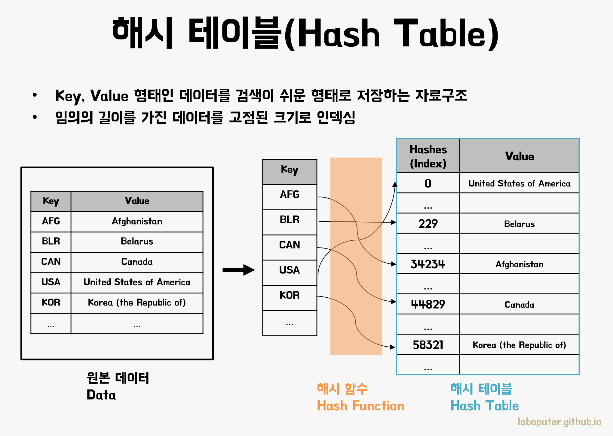

# 🔍 해시(Hash)
  


### 📌 해시
: 임의의 크기를 가진 데이터(Key)를 고정된 크기의 데이터(Value)로 변화시켜 저장하는 것  
- 키에 대한 해시값을 사용하여 값을 저장
- 키-값 쌍의 갯수에 따라 동적으로 크기가 증가하는 associate array
- 키에 대한 해시값을 구하는 과정을 hashing(해싱)이라 한다.
- 해시값 자체를 index로 사용하기 때문에 평균 시간복잡도가 O(1) 로 매우 빠르다
→ 해시 태이블의 크기에 상관없이 **데이터에 빠르게 접근할 수 있다.**
→ 모든 데이터를 살피지 않고, **검색과 삽입/삭제를 빠르게 실행할 수 있다.**
  
#### Hash 함수
- 키에 대한 해시값을 만드는 함수(알고리즘)
- 계산이 복잡하지 않다.
- 키값에 대해 중복없이 해시값을 고르게 만들어 내는 함수가 좋은 함수 (충돌이 일어나지 않을수록 좋다)
- 대표적인 함수: 나눗셈법(Division Method)와 곱셉법(Multiplication Method)
- 좋은 해시함수의 조건, Simple uniform hash 함수  
  - 계산된 해쉬값들은 0부터 배열의 크기-1 사이의 범위를 '동일한 확률'로 골고루 나타날 것.
    → 충돌이 일어날 확률이 적어진다.
  - 각각의 해쉬값들은 서로 연관성을 가지지 않고 독립적으로 생성될 것.
    → 해쉬값들이 서로 연관이 있을 경우 연관성이 있으면 해당 해쉬값이 등장하는 패턴이나 순서가 존재 할 수 있고, 이는 반복적인 충돌을 일으 킬 확률이 있기 때문에 독립적으로 생성되도록 한다.


#### 🔨충돌(Collusion)
해시테이블은 '충돌'이 일어날 수 있다는 문제점이 있다.
충돌이란 키에 대한 해시값이 같은 경우, 즉 사용하고자하는 해시 버킷이 이미 사용중인 경우를 말한다.
  
-> 방지하기위한 방법이 있으나, 충돌을 '완전히' 방지하기는 어렵다는 점이 해시의 한계


*****
### 자바의 해시(Hash)
: Key와 Value가 쌍을 이루는 자료구조
- 필요한 데이터를 키 값을 통해, 아주 빠르게 탐색가능하다.

#### ⭐⭐⭐1. HashMap
- HashMap은 키(Key)값을 통해서만 검색이 가능
- HashMap의 키(Key) 값은 중복될 수 없고, 밸류(Value) 값은 키(Key) 값이 다르다면 중복이 가능

**생성 방법**
``` java
(방법1) HashMap<String, String> h1 = new HashMap<String, String>( );         // 기본 capacity:16, load factor:0.75
(방법2) HashMap<String, String> h2 = new HashMap<String, String>(20);       // capacity:20으로 설정
(방법3) HashMap<String, String> h3 = new HashMap<String, String>(20, 0.8); // capacity:20, load factor:0.8로 설정
(방법4) HashMap<String, String> h4 = new HashMap<String, String>(h1);      // 다른 Map(h1)의 데이터로 초기화

// capacity는 데이터 저장 용량, load factor는 데이터 저장공간을 추가로 확보해야 하는 시점을 지정 //load factor 0.8 은 저장공간이 80% 채워져 있을 경우 추가로 저장공간을 확보한다.
```
  
**메소드**  
1) 데이터 추가  
- V put(K key, V value) : key와 value를 저장합니다.   
- void putAll(Map<? extends K, ? extends V> m) : Map m의 데이터를 전부 저장합니다.  
- V putIfAbsent(K key, V value) : 기존 데이터에 key가 없으면  key와 value를 저장합니다.   

2) 데이터 삭제  
- void clear( ) : 모든 데이터를 삭제합니다.   
- V remove(Object key) : key와 일치하는 기존 데이터(key와 value)를 삭제합니다.   
- boolean remove(Object key, Object value) : key와 value가 동시에 일치하는 데이터를 삭제합니다.  
3) 데이터 수정  
- V replace(K key, V value) : key와 일치하는 기존 데이터의 value를 변경합니다.   
- V replace(K key, V oldValue, V newValue) : key와 oldValue가 동시에 일치하는 데이터의 value를 newValue로 변경합니다.   
   
4) 데이터 확인  
- boolean containsKey(Object key) : key와 일치하는 데이터가 있는지 여부를 반환합니다. (있으면 true)  
- boolean containsValue(Object value) : value가 일치하는 데이터가 있는지 여부를 반환합니다. (있으면 true)  
- boolean isEmpty( ) : 데이터가 빈 상태인지 여부를 반환합니다. (빈 상태면 true)  
- int size( ) : key-value 맵핑 데이터의 개수를 반환합니다.  

5) 데이터 반환  
- V get(Object key) : key와 맵핑된 value값을 반환합니다.   
- V getOrDefault(Object key, V defaultValue) : key와 맵핑된 value값을 반환하고 없으면 defaultValue값을 반환합니다.  
- Set<Map.Entry<K, V>> entrySet( ) : 모든 key-value 맵핑 데이터를 가진 Set 데이터를 반환합니다. 
- Set<K> keySet( ) : 모든 key 값을 가진 Set 데이터를 반환합니다.   
- Collection<V> values( ) : 모든 value 값을 가진 Collection 데이터를 반환합니다.  

#### ⭐2. HashSet
: Set 인터페이스 구현 클래스 -> Set의 성질을 그대로 상속받는다.  

**생성 방법**
``` java
// 타입을 지정 가능
HashSet<String> animals1 = new HashSet<String>();

// 타입을 생략하여 사용 가능 -> 빈 HashSet생성 시 사용
HashSet<String> animals2 = new HashSet<>();  

// 초기 용량(Capacity) 설정
HashSet<String> animals3 = new HashSet<>(10); 

 // animal의 모든 값을 가진 HashSet 생성 
HashSet<String> animals4 = new HashSet<>(animals1);

//초기값 지정 가능
HashSet<String> animals5 = new HashSet<>(Arrays.asList("tiger", "lion", "fox")); 
```

**메소드**  
1) 데이터 추가  
``` java
HashSet<Integer> set = new HashSet<Integer>();//HashSet생성
set.add(1); //값 추가
set.add(2);
set.add(3);
//true, false 반환
```   

2) 데이터 삭제   
``` java
HashSet<Integer> set = new HashSet<Integer>(Arrays.asList(1,2,3));//HashSet생성
set.remove(1);//값 1 제거
set.clear();//모든 값 제거
////true, false 반환
```

3) HashSet 크기 구하기  
``` java
HashSet<Integer> set = new HashSet<Integer>(Arrays.asList(1,2,3));//HashSet생성
System.out.println(set.size());//set 크기 : 3
```

4) HashSet 값 출력  
``` java
HashSet<Integer> set = new HashSet<Integer>(Arrays.asList(1,2,3));//HashSet생성
System.out.println(set); //전체출력 [1,2,3]
		
Iterator iter = set.iterator();	// Iterator 사용
while(iter.hasNext()) {//값이 있으면 true 없으면 false
    System.out.println(iter.next());
}
```

5) HashSet 값 검색  
``` java
HashSet<Integer> set = new HashSet<Integer>(Arrays.asList(1,2,3));//HashSet생성
System.out.println(set.contains(1)); //set내부에 값 1이 있는지 check : true
```
  
### ⭐⭐ HashMap vs HashSet
1. 정의     
HashMap: Map 인터페이스의 구현체, HashTable과 유사한 자료구조로 데이터를 저장한다.    
HashSet: Set 인터페이스의 구현체, 내부적으로 HashMap을 사용하기 때문에 HashTable과 유사한 자료구조로 데이터를 저장한다.  
 
2. 데이터 저장 형태    
HashMap: Key-Value 쌍 형태로 데이터를 저장, Key와 Value의 mapping을 유지한다.    
HashSet: 객체 그 자체를 저장, HashMap을 내부적으로 사용   
-> Key 값으로는 삽입되는 객체 그 자체를, Value 값으로 HashSet 내부 구현 코드에서 미리 선언해둔 dummy 객체를 사용한다.    

3. 중복 허용 여부  
HashMap: 중복 Key 값을 허용하지 않지만, 중복 Value 값은 허용  
ex. {'a': 1, 'b': 1, 'c': 2}  
HashSet : 중복 허용X (Set 인터페이스의 구현체)  
ex. {'a', 'b', 'c'}  

4. NULL 허용 여부  
HashMap: (중복 Key 값을 허용하지 않기 때문에) 단 하나의 NULL 값을 Key 값으로 가질 수 있고, 여러 NULL 값을 Value 값으로 가질 수 있다.  
HashSet: 단 하나의 NULL 값을 가질 수 있다.  

5. 데이터 삽입 방법
HashMap: put() 메서드를 사용, Key-Value 쌍으로 저장하기 때문에 삽입 연산 동안 단 하나의 객체가 생성된다.  
HashSet: add() 메서드를 사용, 객체 그 자체를 저장하고 내부적으로 HashMap을 사용하기 때문에 삽입되는 객체(Key값)와 dummy 객체(Value 값), 총 두 개의 객체가 삽입 연산 동안 생성된다.  

**성능**  
HashMap이 HashSet보다 빠르다.  
-> 데이터의 유일함(Uniqueness)을 유지하기 위해 항상 HashMap이 HashSet보다 선호된다.  

  
*****
### ✅ Reference
![HashMap]<https://kadosholy.tistory.com/120>
![HashSet]<https://velog.io/@acacia__u/hashSet>

