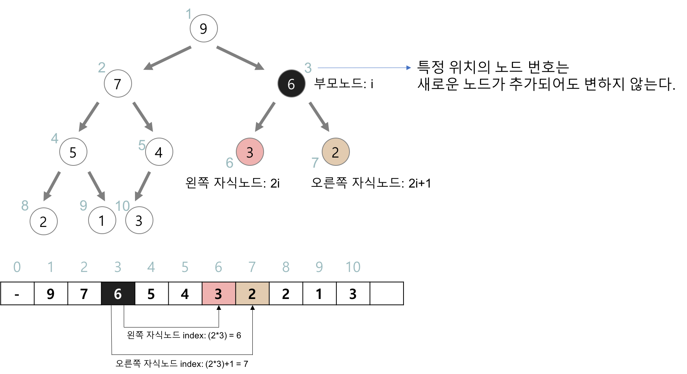

# 🔍 힙(Heap)
: 완전 이진 트리의 일종으로 우선순위 큐를 위하여 만들어진 자료구조

**우선순위 큐**  
: 우선순위의 개념을 큐에 도입한 자료 구조  
- 데이터들이 우선순위를 가지고 있고 우선순위가 높은 데이터가 먼저 나간다.  
- 사례: 시뮬레이션 시스템, 네트워크 트래픽 제어, 운영체제에서의 작업 스케쥴링, 수치 해석적인 계산 
- 배열, 연결리스트, 힙 으로 구현이 가능하지만, 힙(heap)으로 구현하는 것이 가장 효율적이다.  
  

### 💡 힙(Heap)
: 여러 개의 값들 중에서 최댓값이나 최솟값을 빠르게 찾아내도록 만들어진 자료구조
- **반정렬 상태(느슨한 정렬 상태)** 를 유지
  - 큰 값이 상위 레벨에 있고 작은 값이 하위 레벨에 있다
  - 부모 노드의 키 값이 자식 노드의 키 값보다 항상 큰(작은) 이진 트리
  
#### Heap의 종류  
1. 최대 힙(max heap)  
- 부모 노드의 키 값이 자식 노드의 키 값보다 크거나 같은 완전 이진 트리  
- key(부모 노드) >= key(자식 노드)  
  
2. 최소 힙(min heap)   
- 부모 노드의 키 값이 자식 노드의 키 값보다 작거나 같은 완전 이진 트리  
- key(부모 노드) <= key(자식 노드)  
     
  


#### Heap의 구현
- 힙을 저장하는 표준적인 자료구조: **배열**   
- 구현을 쉽게 하기 위하여, 배열의 첫 번째 인덱스인 0은 사용되지 않는다.  
- 특정 위치의 노드 번호는 새로운 노드가 추가되어도 변하지 않는다.  
- 예를 들어 루트 노드의 오른쪽 노드의 번호는 항상 3이다.  
- 힙에서의 부모 노드와 자식 노드의 관계  
  - 왼쪽 자식의 인덱스 = (부모의 인덱스) * 2  
  - 오른쪽 자식의 인덱스 = (부모의 인덱스) * 2 + 1  
  - 부모의 인덱스 = (자식의 인덱스) / 2  

  

``` java
//최소 힙 사용하기
PriorityQueue<Integer> minHeap = new PriorityQueue<>();

//최대 힙 사용하기
PriorityQueue<Integer> maxHeap = new PriorityQueue<Integer>(new Comparator<Integer>() {
        @Override
        public int compare(Integer o1, Integer o2) {
            return - Integer.compare(o1,o2);
        }
    });

PriorityQueue<Integer> maxHeap = new PriorityQueue<>(Collections.reverseOrder());
```


#### Heap의 활용
1. 힙(heap)의 삽입
- 힙에 새로운 요소가 들어오면, 일단 새로운 노드를 힙의 마지막 노드에 이어서 삽입한다.
- 새로운 노드를 부모 노드들과 교환해서 힙의 성질을 만족시킨다.
``` java
// add(value) 메서드의 경우 만약 삽입에 성공하면 true를 반환, 
// 큐에 여유 공간이 없어 삽입에 실패하면 IllegalStateException을 발생
minHeap.add(1);
minHeap.add(10);
minHeap.offer(100);

maxHeap.add(1);
maxHeap.add(10);
maxHeap.offer(100);
```

2.힙(heap)의 삭제
- 최대 힙에서 최댓값은 루트 노드이므로 루트 노드가 삭제된다.
- 최대 힙(max heap)에서 삭제 연산은 최댓값을 가진 요소를 삭제하는 것이다.
- 삭제된 루트 노드에는 힙의 마지막 노드를 가져온다.
- 힙을 재구성한다.
``` java
// 첫번째 값을 반환하고 제거, 비어있다면 null
minHeap.poll();

// 첫번째 값 제거, 비어있다면 예외 발생
minHeap.remove(); 

// 첫번째 값을 반환만 하고 제거 하지는 않는다.
// 큐가 비어있다면 null을 반환
minHeap.peek();

// 첫번째 값을 반환만 하고 제거 하지는 않는다.
// 큐가 비어있다면 예외 발생
minHeap.element();

// 초기화
minHeap.clear();     
```


    
### ✅ Reference
<https://gmlwjd9405.github.io/2018/05/10/data-structure-heap.html>  
<https://velog.io/@gillog/Java-Priority-Queue%EC%9A%B0%EC%84%A0-%EC%88%9C%EC%9C%84-%ED%81%90>

