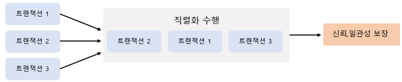
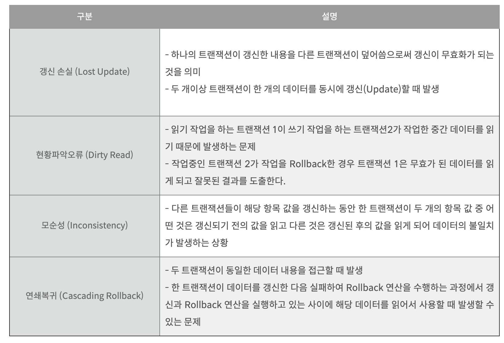
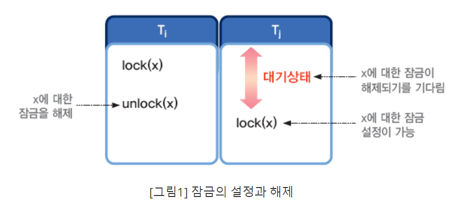
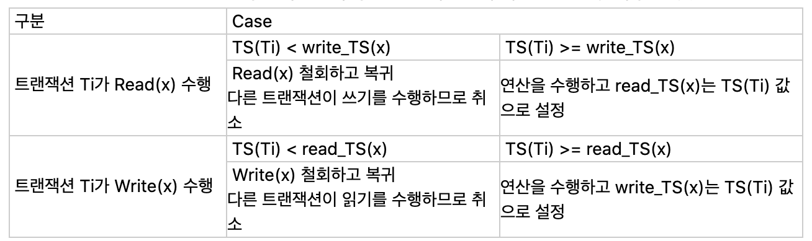
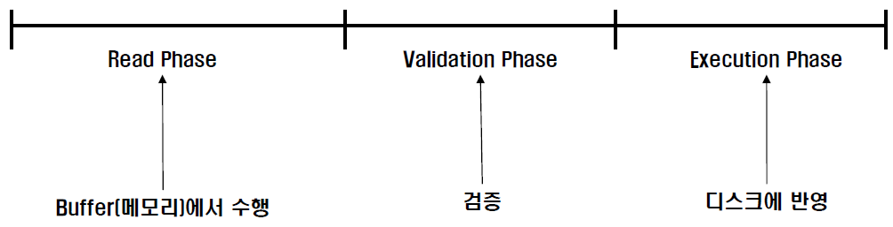
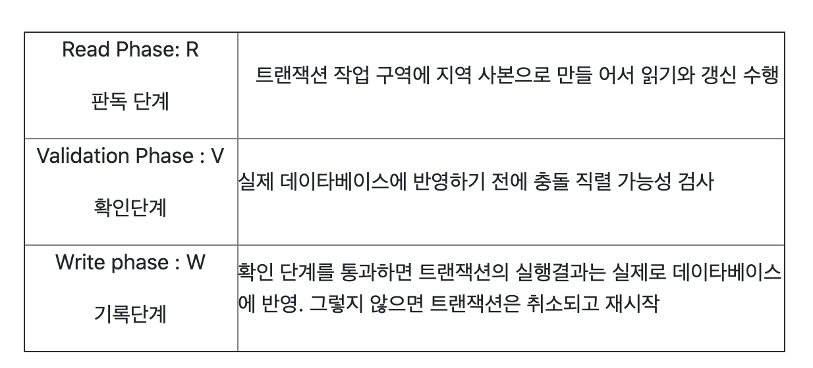
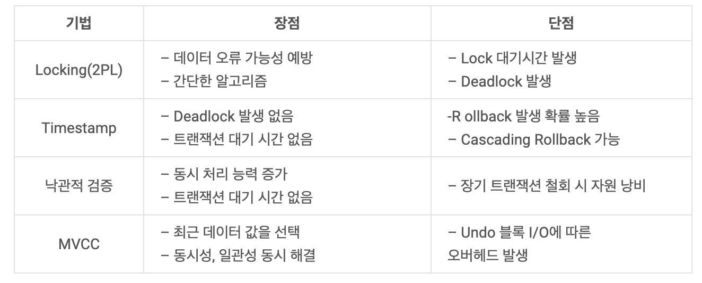

# 💡 Concurrency Control(동시성 제어)

### 🎈 Concurrency (동시성)  
: 여러개의 트랜잭션이 실행될 때 트랜잭션들이 데이터베이스의 일관성을 파괴하지 않고 다른 트랜잭션에 영향을 주지 않으면서 트랜잭션을 제어하는 기법   
  
✔️ **동시성 제어의 정의**  
- 다중 사용자 환경을 지원하는 데이터 베이스 시스템에서 여러 트랜잭션들이 성공적으로 동시에 실행될 수 있도록 지원하는 기능  
- 다중 사용자 환경을 지원하는 DB system의 경우 필수적으로 지원해야 하는 기능으로 병행제어라고도 한다.  
- 트랜잭션의 직렬화 수행 보장한다.  

  
   
  
✔️ **동시성 제어의 목적**  
- 트랜잭션의 직렬성 보장
- 공유도 최대, 응답 시간 최소, 시스템 활동의 최대 보장
- 데이터의 무결성 및 일관성 보장
   
   
💥 **동시성 제어를 하지 않은 경우 발생하는 문제점** 
  

  

  
### ✨ 병행제어 기법
  
####  로킹(Locking)
: 하나의 트랜잭션이 실행하는 동안 특정 데이터 항목에 대해서 다른 트랜잭션이 동시에 접근하지 못하도록 상호배제(Mutual Exclusive) 기능을 제공하는 기법  
- 하나의 트랜잭션이 데이터 항목에 대하여 잠금(lock)을 설정하면, 잠금을 설정한 트랜잭션이 해제(unlock)할 때까지 데이터를 독점적으로 사용할 수 있다.
  
  

- 로킹 단위가 크면 : 관리하기가 용이(로킹 오버헤드 감소), 하지만 동시성 수준이 낮아짐  
- 로킹 단위가 작으면 : 동시성 수준이 높아지지만 관리가 까다로움(로킹 오버헤드 증가)  

 
**✔️ 2단계 로킹 규약(Two-Phase Locking Protocol)**  
Lock과 Unlock이 동시에 이루어지면 일관성이 보장되지 않으므로 Lock만 가능한 단계와 Unlock만 가능한 단계를 구분하며 직렬가능성을 보장함, 
하지만 교착상태가 발생할 수 있음.  

- 확장단계 : 트랜잭션이 Lock만 할 수 있고 Unlock은 할 수 없음  
- 축소단계 : 트랜잭션이 Unlock만 할 수 있고 Lock은 할 수 없음  
    
* [잠금(Locking)기법](https://velog.io/@ha0kim/%EC%9E%A0%EA%B8%88Locking-%EA%B8%B0%EB%B2%95)  
  
       
  
#### 타임스탬프(Time Stamp) 
: 트랜잭션을 식별하기 위하여 DBMS가 부여하는 유일한 식별자인 타임 스탬프를 지정하여 트랜잭션간의 순서를 미리 선택하는 동시성 제어 기법  
- 시스템에 들어오는 트랜잭션의 순서대로 시간 스탬프를 지정하여 동시성 제어의 기준으로 사용한다.
- 교착상태를 방지 할 수 있으나 RollBack 발생률이 높고 연쇄 복귀를 초래할 수 있다.  
  
**✔️ Timestamp 운영방식**
- read_TS(x) : read(x) 연산을 성공적으로 수행한 트랜잭션들의 타임스탬프 중 가장 큰 것  
- write_TS(x) : write(x) 연산을 성공적으로 수행한 트랜잭션들의 타임스탬프 중 가장 큰 것
  
  
  
=> 트랜잭션 Ti가 Write(x) 수행 시 TS(Ti) < write_TS(x) 이면 TS(Ti)가 write(x)를 실행한 것으로 간주하고 무시하는 것이 토마스 기록 규칙(Thomas write rule),  
이는 write 연산 거부로 인한 트랜잭션의 취소를 감소시키기 위한 목적이다  

**✔️ Timestamp 생성기법**
- 논리적 계수기(Logical Count) : 트랜잭션이 발생할 때마다 카운터를 하나씩 증가한다.  
- 시스템 클럭(System clock) : 트랜잭션이 시스템에 들어올때의 시스템 시각을 부여한다.  
  
   
  
#### 낙관적 병행제어(Optimistic Concurrency Control)  
: 트랜잭션 수행 동안은 어떠한 검사도 하지 않고, 트랜잭션 종료 시에 일괄적으로 검사하는 기법  
- 트랜잭션 수행 동안 그 트랜잭션을 위해 유지되는 데이터 항목들의 지역 사본에 대해서만 갱신이 이루어진다.  
- 트랜잭션 종료 시에 동시성을 위한 트랜잭션 직렬화가 검증되면 일시에 DB로 반영한다.  
  
**✔️ 낙관적 검증 기법 구성도**  
  
  
  
  
   
  
#### 다중 버전 병행제어 (MVCC, Multi-version Concurrency Control)  
트랜잭션이 한 데이터 아이템을 접근하려 할 때, 그 트랜잭션의 타임스탬프와 접근하려는 데이터 아이템의 여러 버전의 타임스탬프를 비교하여   
현재 실행하고 있는 스케줄의 직렬가능성이 보장되는 적절한 버전을 선택하여 접근하도록 하는 기법  
  
- 하나의 데이터 아이템에 대해 여러 버전의 값 유지한다.  
  
**✔️ 다중버전 병행 제어 기법의 특징**  
- 판독 요청을 거절하지도, 대기하지도 않음  
- 기록보다 판독 연산이 주류를 이루는 데이터 베이스 시스템에 큰 이점  
- 데이터 아이템을 판독할 때마다 중복되는 디스크 접근  
- 트랜잭션간의 충돌문제는 대기가 아니라 복귀처리 함으로 연쇄 복귀초래 발생 가능성  
  
   
  
#### 🔧 동시성 제어 기법 비교  
  

   
  
### ✔️ Reference  
[병행 제어(Concurrency Control)](https://kosaf04pyh.tistory.com/300)
[동시성 제어(Concurrency Control)](https://velog.io/@ha0kim/%EB%8F%99%EC%8B%9C%EC%84%B1-%EC%A0%9C%EC%96%B4)
