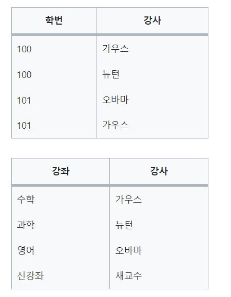

# 💡 ERD와 정규화

   
   
### 🎈 ERD  
: Entity Relationship Diagram의 약자로, **데이터베이스를 구축할 때 가장 기초적인 뼈대 역할**을 하며, 릴레이션 간의 관계들을 정의한 것이다.  

    
✔️ **ERD의 중요성**  
- 시스템의 요구 사항을 기반으로 작성되며 이 ERD를 기반으로 데이터베이스를 구축한다.  
- 이 후, 디버깅 또는 비즈니스 프로세스 재설계가 필요한 경우에도 **설계도 역할**을 담당하기도 한다.  
- ERD는 **관계형 구조로 표현**할 수 있어 데이터를 구성하는 데 유용하다.  
- 하지만, **비정형 데이터를 충분히 표현할 수 없다는 단점**이 있다.  
  
※ 비정형 데이터 : 비구조화 데이터를 말하며, 미리 정의된 데이터 모델이 없거나 미리 정의된 방식으로 정리되지 않은 정보로 말한다.

**[예시]**   
요구 사항  

- 영업사원은 0~n명의 고객을 관리.  
- 고객은 0~n개의 주문을 넣을 수 있음  
- 주문에는 1~n개의 상품이 들어감  
    
   

    

  
### ✨ 정규화(Normalization)  
: 릴레이션 간의 잘못된 종속 관계로 인해 데이터베이스 **이상 현상**이 발생하여 해결하거나 저장 공간을 효율적으로 사용하기 위해 **릴레이션을 분리하는 것**  
  
  
**✔️ 이상 현상 (Anomaly)**
1. 삭제 이상: 튜플 삭제 시 같이 저장된 다른 정보까지 연쇄적으로 삭제
2. 삽입 이상: 튜플 삽입 시 특정 속성 해당하는 값 없어 Null 삽입
3. 수정 이상: 튜플 수정 시 중복 데이터 일부만 삭제되어 데이터 불일치
  
     
  
#### 제 1 정규형  
- 릴레이션의 모든 도메인이 **더는 분리할 수 없는 원자 값 만으로 구성**  
- 한 개의 기본키에 대해 두 개 이상의 값을 가지는 반복 집합을 분리   
    
    
  
-> 수강과목과 성취도 부분에 반복 집합이 존재하여 이를 분리해야 함  

  

       
  
#### 제 2 정규형  
- 릴레이션이 제 1 정규형이며 부분 함수 종속성을 제거한 형태(완전 함수 종속)  
- 기본키가 아닌 모든 속성이 기본키에 **완전 함수 종속**되면 제2 정규형에 속함

**✔️ 부분 함수 종속과 완전 함수 종속**
- 부분 함수 종속: {주민번호, 성별}에서, 주민 번호에 따라 사람 이름이 정해지는 상황이면 사람 이름은 {주민번호, 성별}에 부분 함수 종속된다고 한다.  
- 완전 함수 종속: {아이디, 이벤트번호}에서, 둘 모두에 따라 당첨 여부가 정해지는 상황이면 당첨 여부는 {아이디, 이벤트번호}에 완전 함수 종속된다고 한다.  
  
    
  
제 1 정규형을 만족하는 위 테이블에서 기본 키인 {ID, 수강과목}에 완전 종속되지 못하는 번호 속성이 존재함. (번호는 ID 속성에 종속)  
-> 이를 분리하기 위해 테이블을 두 개로 나눔  

  
  
각 테이블은 각 기본 키인 {ID}와 {ID, 수강과목}에 완전 종속되어 제 2 정규형을 만족한다.  
단 분해 시에 동등한 릴레이션으로 분리하며 **무손실 분해**로 진행되어야 한다.  

**✔️ 무손실 분해**
: 테이블을 나누고 다시 조인 연산을 통해 합쳤을 경우 데이터 손실이 없는 분해   

  
- 나눈 두 집합 R1, R2의 공통 속성이 R1 또는 R2의 키 인경우 무손실  
- 위의 경우에는 공통 속성인 name이 키가 아니므로 손실 발생가능  
  
   

#### 제 3 정규형  
- 제2 정규형이고 기본키가 아닌 모든 속성이 **이행적 함수 종속을 만족하지 않는 상태**   
  
**✔️ 이행적 함수 종속**  
: A->B를 만족하고 B->C를 만족할 때 C가 A에 이행적 함수 종속된다.  
  
  
위 테이블은 부분 함수 종속성이 없는 제 2 정규형 테이블이지만, ID -> 등급 을 만족하고 등급 -> 할인율 을 만족하므로 할인율이 ID에 이행적 함수 종속된다.  
-> 위 테이블을 {ID, 등급}과 {등급, 할인율}로 분리하면 제 3 정규형을 만족한다.  
  
   

#### BCNF 정규형 (보이스 / 코드)  
- 제 3 정규형이고 결정자가 후보키가 아닌 함수 종속 관계를 제거한 상태로, 릴레이션의 함수 종속관계에서 **모든 결정자가 후보 키**인 상태

   
위 릴레이션에선 {학번, 강좌} 또는 {학번, 강사}가 후보키가 된다.   
하지만 위 테이블에 강좌를 추가하려는 경우, 강좌와 강사를 추가했을 때 학번이 Null이 삽입되는 경우가 발생한다.  

-> 후보 키가 아닌 속성이 결정자가 되는 경우 문제가 발생할 수 있으므로 강사 속성으로 테이블을 분리한다.  

   
강사 속성이 후보키에 속하도록 테이블을 분리하면 BCNF를 만족하게 된다.  

   
  
#### 🔧 정규화의 단점  
- 정규형을 이용해 효율적으로 데이터를 관리할 수 있지만 테이블을 나눈다고 무조건 성능이 좋아지는 것이 아니다.  
- 조인을 사용해야 하는 쿼리를 처리하는 경우 작은 테이블들 여러개를 합치는 작업을 여러 번 거칠 수 있어 막상 성능은 떨어질 수 있다.  

   
  
### ✔️ Reference  
<https://velog.io/@oyunseong/ERD%EC%99%80-%EC%A0%95%EA%B7%9C%ED%99%94-%EA%B3%BC%EC%A0%95>  
<https://velog.io/@ich0906/ERD%EC%99%80-%EC%A0%95%EA%B7%9C%ED%99%94>  
   
