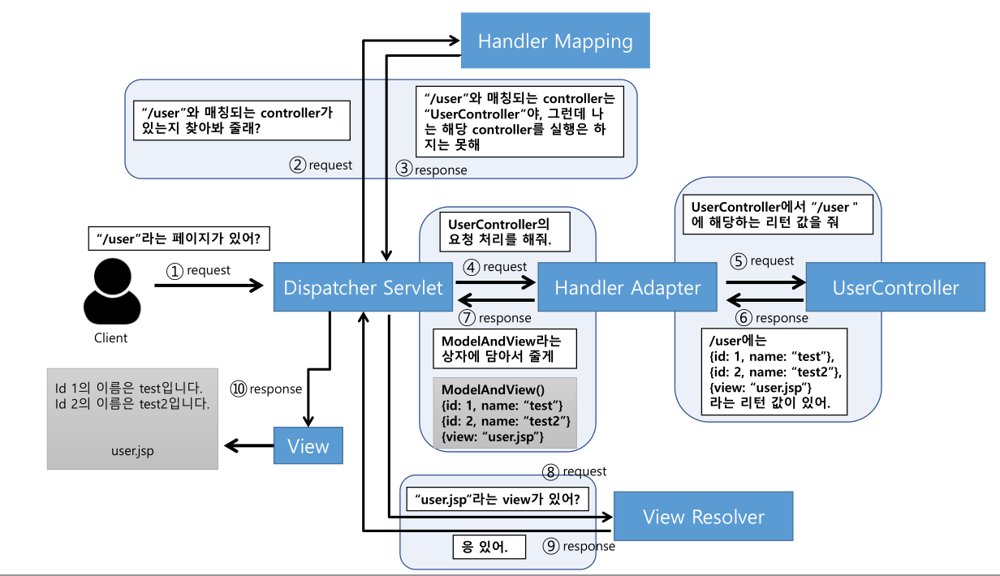
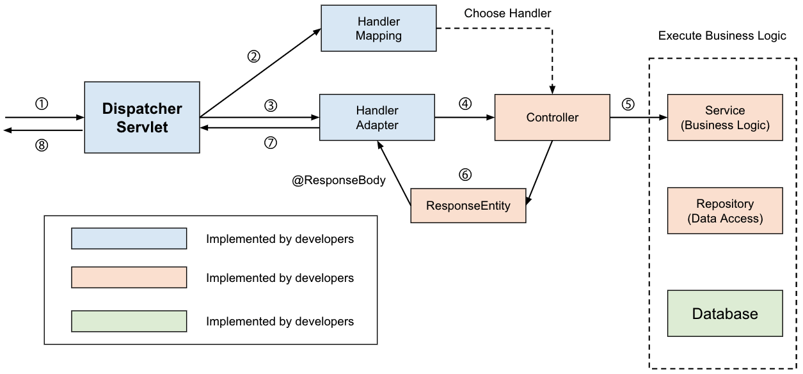

# 💡 @controller vs @restcontroller  
Spring에서 컨트롤러를 지정해주기 위한 어노테이션은 @Controller와 @RestController가 있다.  
  
``` java
//spring mvc에서 동일하게 동작
@Controller
@ResponseBody
public class MVCController{
	logic...
}

@RestController
public class ReftFulController{
	logic...
}
```
=> @RestController를 사용하면, @Controller에서 @ResponseBody 어노테이션을 사용할 필요가 없다.  
<br/>  
   
### 🍬@controller  
: 전통적인 Spring MVC의 컨트롤러    
- Client의 요청으로부터 View를 반환  
- Model 객체를 만들어 데이터를 담고 View를 찾는 것  
<br/>

✔️ **Controller가 Client 요청으로부터 View를 반환하는 과정**  
    
   
[과정]  
1. Client는 URL형식으로 요청을 보낸다.  
2. DispatcherServlet이 요청을 위임할 Handler Mapping을 찾는다.  
3. Handler Mapping을 통해 요청을 Controller로 위임한다.   
4. Controller는 요청을 처리한 후 View Name을 Handler Adapter한테 반환한다.  
5. Handler Adapter는 이걸 DispatcherServlet한테 반환한다.    
6. DispatcherServlet는 View Resolver를 통해 View Name에 해당하는 View를 찾아서 Client한테 반환한다.  
  
<br/>   
✔️ **Controller가 Client 요청으로부터 Data를 반환하는 과정**  
: @ResponseBody 사용  
    
    
[과정]  
1. Client는 URL형식으로 요청을 보낸다.  
2. DispatcherServlet이 요청을 위임할 Handler Mapping을 찾는다.  
3. Handler Mapping을 통해 요청을 Controller로 위임한다.   
4. Controller는 요청을 처리한 후 객체를 반환한다.  
5. 반환되는 객체는 JSON으로 직렬화(Serialize)돼서 Client에게 반환된다.  

    
<br/>  
### 🍭 @restcontroller  
: @Controller와 @ResponseBody의 조합  
- RESTful 웹 서비스를 보다 쉽게 개발할 수 있도록 Spring 4.0에서 추가됨  
- JSON 형태의 객체 데이터를 반환합  
- Restful Web Service에서 사용되는 컨트롤러 어노테이션  
     
``` java
//@Controller 사용 시 
@Controller
@RequestMapping("books")
public class SimpleBookController {

    @GetMapping("/{id}", produces = "application/json")
    public @ResponseBody Book getBook(@PathVariable int id) {
        return findBookById(id);
    }

    private Book findBookById(int id) {
        // ...
    }
}

//@RestController 사용 시 
@RestController
@RequestMapping("books-rest")
public class SimpleBookRestController {
    
    @GetMapping("/{id}", produces = "application/json")
    public Book getBook(@PathVariable int id) {
        return findBookById(id);
    }

    private Book findBookById(int id) {
        // ...
    }
}
```
  
<br/>  
### 💥 @controller vs @restcontroller 의 차이점  
- HTTP ResponseBody가 생성되는 방식  
- @RestController = @Controller + @ResponseBody  
  
<br/>  
### ✔️ Reference
<https://dncjf64.tistory.com/288>
<https://mangkyu.tistory.com/49>
   
