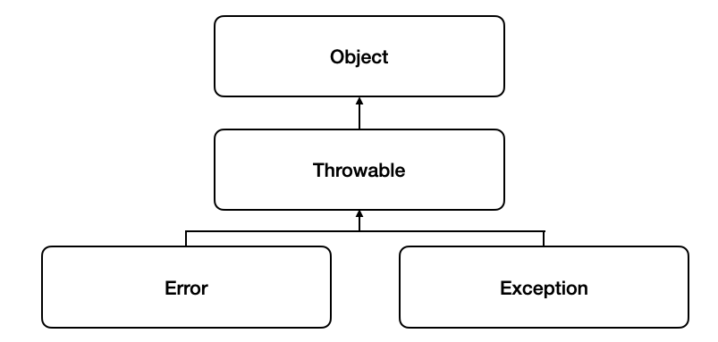
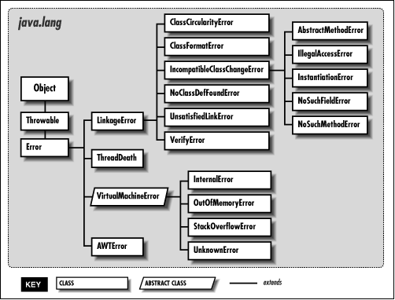
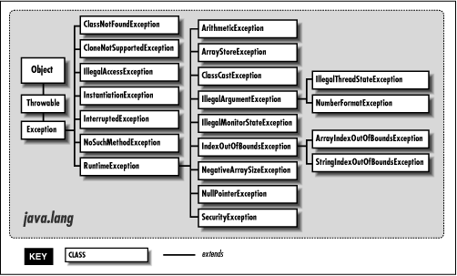

# 💡 오류(Error)&예외(Exception)
  
### Throwable  
getMessage()와 printStackTrace()라는 메서드로 구현됨  
-> 이를 상속받은 Error와 Exception에서 두 메서드를 사용  
-> 오류와 예외는 메시지를 담을 수 있고 어떤 원인에 의해 발생했는지를 연결해 출력해줄 수 있다.  
 

### ✏️ Error
: 시스템이 종료되어야 할 수준의 상황과 같이 수습할 수 없는 심각한 문제, **개발자가 미리 예측하여 방지할 수 없음.** 

  

ex)  
- StackOverflowError : 응용 프로그램이 너무 많이 반복(호출의 깊이가 깊어지거나 재귀가 지속)되어 stack overflow 발생 시 던져지는 오류    
- OutOfMemoryError : JVM이 할당된 메모리의 부족으로 더 이상 객체를 할당할 수 없을 때 던져지는 오류  
  - Garbage Collector에 의해 추가적인 메모리가 확보되지 못하는 상황일 때  
  - heap 사이즈 부족    
  - 너무 많은 class를 로드할 때  
  - 가용가능한 swap이 없을 때  
  - 큰 메모리의 native메서드가 호출될 때  

* 개발자가 직접 방지할 수 없지만 간접적인 예방은 가능하다.  
StackOverflowError - 재귀를 사용할 때에 주의를 기울이고, 가시적인 loop를 사용  
OutOfMemoryError - 새는 메모리를 차단, heap의 크기를 늘려주는 방법을 사용  

### ✏️ Exception  
: 개발자가 구현한 로직에서 발생한 실수나 사용자의 영향에 의해 발생, 오류와 달리 **개발자가 미리 예측하여 방지할 수 있기**에 상황에 맞는 예외처리(Exception Handle)를 해야 한다.   
  
   
  
#### Exception 종류  
**1. Checked Exception**  
- 예외처리가 필수이며, 처리하지 않으면 컴파일되지 않는다.  
- *try-catch로 감싸거나 throw로 던져서 예외처리.*  
- 컴파일 단계에서 명확하게 Exception체크가 가능하다. *Runtime Exception*  
- 예외 발생시 트랜잭션을 roll-back 하지 않고 예외를 던져준다.  
- JVM 외부와 통신(네트워크, 파일시스템 등)할 때 주로 쓰인다.  
  
**2. UncheckedException**  
- RuntimeException 하위의 모든 예외  
- NullPointerException, IndexOutOfBoundException 등등  
- 실행과정 중 어떠한 특정 논리에 의해 발견되는 Exception  
- 예외 발생시 트랜잭션을 roll-back한다.  
- 명시적인 예외처리를 하지 않아도 된다.  

ex)   
- ArithmeticException : 정수를 0으로 나눌경우 발생   
- ⭐️ ArrayIndexOutOfBoundsException : 배열의 범위를 벗어난 index를 접근할 시 발생  
- ⭐️⭐️ ClassCastException : 변화할 수 없는 타입으로 객체를 반환 시 발생  
- ⭐️⭐️⭐️ NullPointerException : 객체가 필요한 경우, 응용프로그램이 null을 사용하려고 시도할 때 던져지는/던질 수 있는 예외    
- ⭐️⭐️⭐️ IllegalArgumentException : 메서드가 허가되지 않거나 부적절한 argument를 받았을 경우에 던져지는/던질 수 있는 예외
- IllegalStateException : 객체의 상태가 메서드 호출에는 부적절한 경우에 발생  
- IOException : 입출력 동작 실패 또는 인터럽트 시 발생  
- OutOfMemoryException : 메모리가 부족한 경우 발생  
- ⭐️⭐️ NumberFormatException : 문자열이 나타내는 숫자와 일치하지 않는 타입의 숫자로 변환시 발생  
- CurrentModificationException : 금지된 곳에서 객체를 동시에 수정하는 것이 감지될 경우 발생  
- UnsupportedOperationException : 객체가 메서드를 지원하지 않는 경우 발생  
    
=> 응용 프로그램의 로직이 진행되다가 개발자가 임의로 예외를 던질 수 있다는 의미 => 예외 처리를 개발자가 할 수 있음  
   
#### Exception Handling
Java에서 모든 예외가 발생하면 (XXX)Exception 객체를 생성한다.  
예외를 처리하는 방법에는 크게 2가지가 있다.  
1. 직접 try-catch를 이용해서 예외에 대한 최종적인 책임을 지고 처리하는 방식  
2. Throws Exception을 이용해서 발생한 예외의 책임을 호출하는 쪽이 책임지도록 하는 방식 (주로 호출하는 쪽에 예외를 보고할 때 사용함)  
다른 메서드의 일부분으로 동작하는 경우엔 던지는 것을 추천.  
  
  
### ✔️ Reference
<https://docstore.mik.ua/orelly/java/langref/ch09_04.htm>
