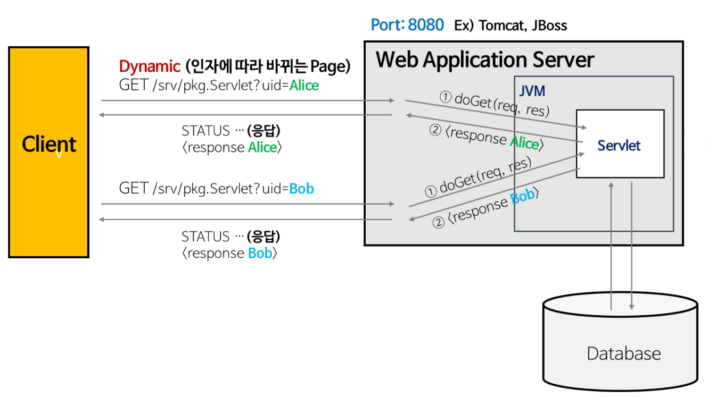
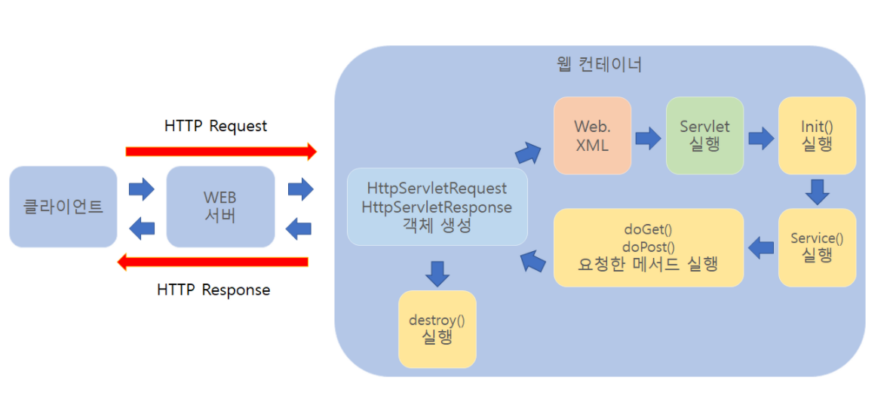

# 서블릿(Servlet)

## 서블릿이란?

> 동적 웹 페이지를 만들 때 사용되는 자바 기반의 웹 어플리케이션 프로그래밍 기술.
> 서블릿은 웹 요청과 응답의 흐름을 간단한 메서드 호출만으로 체계적으로 다룰 수 있게 해준다.

서블릿은 서버에서 실행되다가 웹 브라우저에서 요청을 하면 해당 기능을 수행한 후 웹 브라우저에 결과를 전송한다.
쉽게 예를 들면 로그인 시도를 할 때, 서버가 클라이언트에서 입력되는 아이디와 비밀번호를 확인하고 결과를 응답하는데 이러한 역할을 수행하는 것이 **서블릿**이다.

### 서블릿(Servlet)의 주요 특징
- 클라이언트의 Request에 대해 동적으로 작동하는 웹 어플리케이션 컴포넌트
- 기존의 정적 웹 프로그램의 문제점을 보완하여 동적인 여러가지 기능을 제공
- Java의 스레드를 이용하여 동작
- MVC 패턴에서 컨트롤러로 이용됨
- 컨테이너에서 실행
- 보안기능을 적용하기 쉬움

## 서블릿의 동작과정

1. 클라이언트 요청
2. HttpServletRequest, HttpServletResponse 객체 생성
3. web.xml이 어느 서블릿에 대해 요청한 것인지 탐색
4. 해당하는 서블릿에서 service() 메소드 호출
5. doGet() 또는 doPost() 호출
6. 동적 페이지 생성 후 ServletResponse 객체에 응답 전송
7. HttpServletRequest, HttpServletResponse 객체 소멸

## 서블릿의 생명주기
> 서블릿도 자바 클래스이므로 실행하면 초기화부터 서비스 수행 후 소멸하기까지의 과정을 거친다. 이 과정을 서블릿의 생명주기라하며 각 단계마다 호출되어 기능을 수행하는 콜백메서드를 서블릿 생명주기 메서드라한다.

초기화 : init()
- 서블릿 요청시 맨 처음 한번만 호출된다.
- 서블릿 생성시 초기화 작업을 주로 수행한다.

작업수행 : doGet(), doPost()
- 서블릿 요청 시 매번 호출된다.
- 실제로 클라이언트가 요청하는 작업을 수행한다.

종료 : destroy()
- 서블릿이 기능을 수행하고 메모리에서 소멸될때 호출된다.
- 서블릿의 마무리 작업을 주로 수행한다.

## 서블릿 컨테이너
> 구현되어있는 servlet 클래스의 규칙에 맞게 서블릿을 담고 관리해주는 컨테이너다. 클라이언트에서 요청을 하면 컨테이너는 HttpServletRequest, HttpServletResponse 두 객체를 생성하여 post, get 여부에 따라 동적인 페이지를 생성하여 응답을 보낸다.

- 웹 서버와의 통신 지원
- 서블릿 생명주기 관리
- 멀티쓰레드 지원 및 관리
- 선언적인 보안 관리
