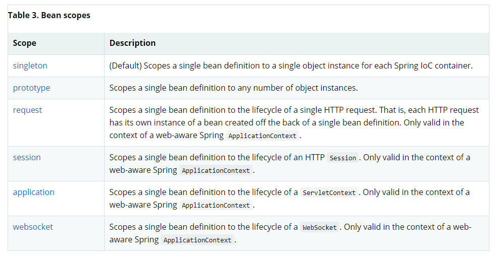

# Bean(scope)

## 빈 스코프란?
> - bean이 사용되어지는 범위
> 
> - 빈이 앱이 구동되는 동안 한개만 만들어서 쓸 것인지 HTTP 요청마다 생성해서 쓸것인지 등등 결정하는 것
> 
> - 보통의 스프링 빈은 스프링 앱이 구동 될 때 한번에 ApplicationContext에서 한번에 모두 생성해서 하나의 클래스는 한 개의 빈만 가지지만(Singleton), 때에 따라서는 HTTP 요청마다(Request) 다른 빈을 생성해서 쓸것인지, 매번 사용될 때마다(Prototype) 빈을 생성해서 쓸것인지 설정해서 쓸 수 있다.



## ProtoType 스코프를 사용하는 방법
```java
@Component
@Scope(value = "prototype")
public class ProtoType{
}
```
컴포넌트로 등록하면서, **@Scope**를 붙여주면 된다.
value의 값으로는 위에서 언급한 값의 Scope 이름이 String으로 들어가게됨
